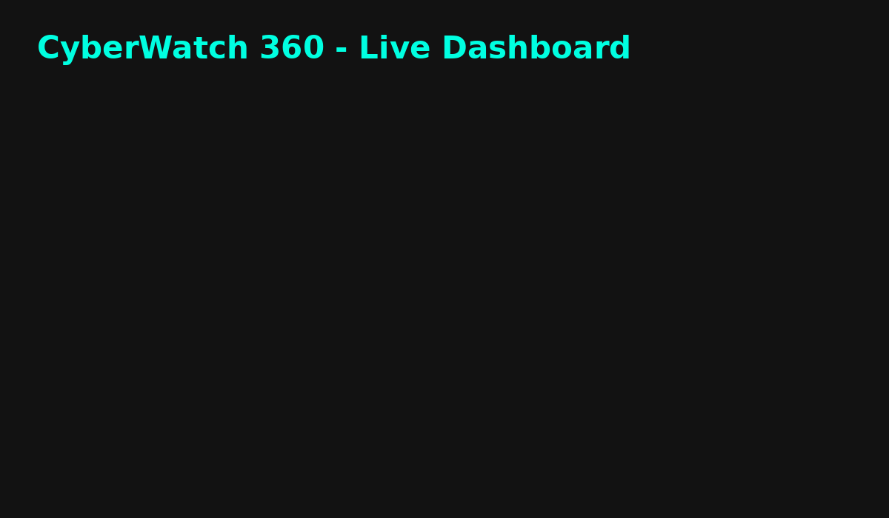

# 🔒 CyberWatch 360 – Live Security Dashboard

🚀 A modern, interactive, open-source security dashboard built to visualize Nmap scan results, guide users on powerful Nmap usage, and help build custom scanning commands — all inside a sleek dark-mode UI.

---

## ✨ Features

- 📊 **Live Risk Dashboard** – View open ports and services with risk levels
- 🧰 **Custom Nmap Scanner Builder** – Click-to-copy Nmap commands for:
  - Vulnerability Scans
  - Password Audits
  - Web Scanning
  - Wireless Scanning
  - Exploitation Attempts
- 📚 **Learn Nmap Section** – With links to official [Nmap documentation](https://nmap.org/book/man.html)
- 🌑 **Dark Mode** – Clean, professional look
- 📋 **Clipboard Integration** – Copy scan commands with a single click

---

## 💬 Demo

---

## 🚀 How to Use

1. **Fork this repository** or [Download as ZIP](https://github.com/jeffmes3/cyberwatch360/archive/refs/heads/main.zip)
2. **Customize `scan.json`** with your own data
3. Enable **GitHub Pages** under:
   - `Settings → Pages → Source: main branch / root`
4. Visit your live dashboard at:  
   `https://jeffmes3.github.io/cyberwatch360/`

---

## 📚 Learn Nmap Safely

This dashboard includes guided examples for:

- `nmap --script vuln`
- `nmap --script brute`
- `nmap -sV -O`
- and more!

Official docs: [https://nmap.org/book/man.html](https://nmap.org/book/man.html)

---

## 🤝 Contributing

Want to improve this dashboard?

- Fork this repo
- Create a new feature branch
- Submit a Pull Request!

---

## 🛡 Security

Please report any vulnerabilities via email: `security@yourdomain.com`.

---

## 📄 License

MIT License © 2025